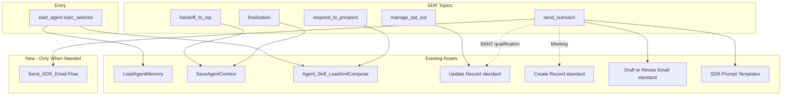

# SDR Agent Implementation Plan (Agent Script + LTM + Agent Skills)

## Design Principle: Leverage Existing Assets First

Maximize use of platform and built-in SDR assets. Implement new Apex/Flow actions **only when no existing asset can fulfill the requirement**.

---

## Existing Assets to Leverage (No New Code)

| Asset                                         | Source                               | Use in SDR Agent                                                                                                 |
| --------------------------------------------- | ------------------------------------ | ---------------------------------------------------------------------------------------------------------------- |
| **LoadAgentMemory** (apex://)                 | LTM-Agentforce                       | Load persistent memory at session start                                                                          |
| **SaveAgentContext** (apex://)                 | LTM-Agentforce                       | Persist context at handoff/finalization                                                                          |
| **Agent_Skill_LoadAndCompose** / Load_And_Compose_Agent_Skills | This project                         | Load SDR role, skills, workflows from Agent_Skills_Repo__c (agents use `apex://Agent_Skill_LoadAndCompose`)       |
| **Update Record**                             | Agentforce standard action           | BANT updates, Lead Status, opt-out (Do Not Contact)                                                              |
| **Create Record**                             | Agentforce standard action           | Create Event for meeting scheduling                                                                              |
| **Query Records** / **Get Record Details**    | Agentforce standard action           | Look up Lead/Contact, engagement history                                                                         |
| **Draft or Revise Email**                     | Agentforce standard action           | Draft intro/follow-up emails (conversation context)                                                              |
| **SDR Prompt Templates**                      | Built-in when Lead Nurturing enabled | "Draft Agentforce SDR Intro Email", "Follow-up on Agentforce SDR" – use `generatePromptResponse://` if available |
| **Data Library**                              | Setup → Agentforce Data Library      | FAQs, pricing, product info for Respond to Prospect                                                              |
| **Sales Engagement, EAC, Email Productivity** | Auto-enabled with Lead Nurturing     | Email delivery, activity capture                                                                                 |

---

## Architecture Overview

---

## Capability Mapping: Built-in SDR vs Agent Script Implementation

| Built-in SDR Capability            | Agent Script Implementation                     | Asset Used                                                                                                             |
| ---------------------------------- | ----------------------------------------------- | ---------------------------------------------------------------------------------------------------------------------- |
| Send Outreach (intro + follow-up)  | `send_outreach` topic                           | **Draft or Revise Email** standard + **SDR Prompt Templates** for drafting; **Send_SDR_Email** Flow (new) for delivery |
| Respond to Prospect (FAQ, pricing) | `respond_to_prospect` topic                     | **Agent_Skill_LoadAndCompose** + **Data Library** via skill instructions                                               |
| Manage Opt-Out                     | `manage_opt_out` topic                          | **Update Record** standard (Do Not Contact, Lead Status)                                                               |
| Lead qualification (BANT)          | `skill-lead-qualification` + topic instructions | **Update Record** standard                                                                                             |
| Meeting scheduling                 | `skill-meeting-scheduling` + topic instructions | **Create Record** standard (Event)                                                                                     |
| Handoff to rep                     | `handoff_to_rep` topic                          | **SaveAgentContext** (LTM)                                                                                             |
| Persistent memory                  | `start_agent` + `finalization`                  | **LoadAgentMemory**, **SaveAgentContext** (LTM)                                                                        |

---

## LTM and Lead/Contact Scope

**Current LTM design:** [Agent_Context__c](force-app/main/default/objects/Agent_Skills_Repo__c/Agent_Skills_Repo__c.object-meta.xml) uses `Contact__c` only (from LTM-Agentforce).

**Phase 1 (recommended):** Use Contact for SDR context. Works for:

- Converted leads (Contact exists after conversion)
- Person Accounts (Contact record)
- Existing contacts in nurture programs

**Phase 2 (optional):** Extend LTM-Agentforce to support Lead via `Lead__c` lookup on `Agent_Context__c` and update `LoadAgentMemory` / `SaveAgentContext` to accept `leadId` or `contactId`. Requires changes in the LTM-Agentforce project.

---

## Implementation Phases

### Phase 1: Agent Skills (SDR Roles, Skills, Workflows)

Add SDR-specific records to [Agent_Skill_SeedService.cls](force-app/main/default/classes/Agent_Skill_SeedService.cls) or create a new `seedSdrAgent()` method:

| Name                                 | Type       | Purpose                                                                     |
| ------------------------------------ | ---------- | --------------------------------------------------------------------------- |
| `role-sdr-agent`                     | Role       | SDR identity, tone, outreach behavior, AI disclosure                        |
| `core-skill-ltmManagement-sdr-agent` | Core_Skill | LTM hydration for SDR (adapt from `core-skill-ltmManagement-service-agent`) |
| `core-skill-sdr-email-guidelines`    | Core_Skill | Email tone, value proposition, proof points, nudge settings                 |
| `skill-send-outreach`                | Skill      | Intro email, follow-up sequences, personalization rules                     |
| `skill-respond-to-prospect`          | Skill      | FAQ handling, pricing/product info, objection responses                     |
| `skill-manage-opt-out`               | Skill      | Opt-out handling, Do Not Contact updates                                    |
| `skill-lead-qualification`           | Skill      | BANT capture, lead scoring, qualification criteria                          |
| `skill-meeting-scheduling`           | Skill      | Calendar availability, booking flow                                         |
| `workflow-sdr-handoff-to-rep`        | Workflow   | Handoff summary, context transfer, assignment                               |

Reference existing patterns in [Agent_Skill_SeedService.cls](force-app/main/default/classes/Agent_Skill_SeedService.cls) (lines 8-70 for role, 49-69 for core-skill-ltmManagement).

---

### Phase 2: Actions – Use Existing Assets; Only One New Flow

**Use standard actions and prompt templates** (no custom code):

| Capability                                  | Action                | Target Format                                                                      |
| ------------------------------------------- | --------------------- | ---------------------------------------------------------------------------------- |
| Update Lead/Contact (BANT, status, opt-out) | Update Record         | Standard action – assign in Agentforce Builder or via Agent Script if supported    |
| Create Event (meeting)                      | Create Record         | Standard action                                                                    |
| Draft intro/follow-up email                 | Draft or Revise Email | Standard action                                                                    |
| Draft with SDR template                     | SDR Prompt Template   | `generatePromptResponse://` + template API name (e.g. when Lead Nurturing enabled) |

**Build only when needed:**

| Action           | Type              | Why New                                                                                                                                                                                                               |
| ---------------- | ----------------- | --------------------------------------------------------------------------------------------------------------------------------------------------------------------------------------------------------------------- |
| `Send_SDR_Email` | Flow (autolaunch) | No standard "Send Email" agent action exists. Draft or Revise Email creates drafts; actual sending requires a Flow. Thin wrapper: inputs (recipientId, subject, body) → standard Flow "Send Email" element → success. |

**Implementation note:** Agent Script action targets use `flow://`, `apex://`, or `generatePromptResponse://`. Standard actions (Update Record, Create Record, Draft or Revise Email) may be assignable in Agentforce Builder after publish. If Agent Script does not support referencing them directly, create thin autolaunch Flows that wrap the standard Flow elements (Update Records, Create Records) – no custom Apex. Prefer Builder-assigned standard actions over new Flows when possible.

---

### Phase 3: Agent Script Authoring Bundle

Create new bundle at `force-app/main/default/aiAuthoringBundles/sdr_agent_demo/`:

**Files:**

- `sdr_agent_demo.agent` – Agent Script definition
- `sdr_agent_demo.bundle-meta.xml` – Bundle metadata (copy from [customer_support_skill_demo.bundle-meta.xml](force-app/main/default/aiAuthoringBundles/customer_support_skill_demo/customer_support_skill_demo.bundle-meta.xml))

**Structure (mirroring [customer_support_skill_demo.agent](force-app/main/default/aiAuthoringBundles/customer_support_skill_demo/customer_support_skill_demo.agent)):**

1. **system** – SDR-specific instructions, welcome/error messages
2. **config** – `developer_name: sdr_agent_demo`, `agent_label`, `default_agent_user` (SDR agent user with Einstein Agent license)
3. **variables** – `ContactId`, `EndUserId`, `RoutableId`, `context_loaded`, `agent_memory`, `instruction_bundle_json`, `composed_instructions`, `save_success`; add `LeadId` if Phase 2 LTM extension is done
4. **start_agent topic_selector** – Load LTM via `apex://LoadAgentMemory`, load role/core skills via `apex://Agent_Skill_LoadAndCompose` (e.g. `role-sdr-agent`, `core-skill-ltmManagement-sdr-agent`, `core-skill-sdr-email-guidelines`), transition to `send_outreach` or `respond_to_prospect` based on intent
5. **topic send_outreach** – Load `skill-send-outreach`. Use **Draft or Revise Email** (or SDR prompt template) to draft; use **Send_SDR_Email** Flow to send. Route to `respond_to_prospect` or `finalization`.
6. **topic respond_to_prospect** – Load `skill-respond-to-prospect`, answer questions using composed instructions (Data Library content via skill text). Route to `manage_opt_out`, `handoff_to_rep`, or `finalization`.
7. **topic manage_opt_out** – Load `skill-manage-opt-out`, invoke **Update Record** standard action (Do Not Contact, Lead Status). Transition to `finalization`.
8. **topic handoff_to_rep** – Load `workflow-sdr-handoff-to-rep`, prepare handoff summary, call `apex://SaveAgentContext`, transition to `finalization`
9. **topic finalization** – Persist LTM via `apex://SaveAgentContext` (same pattern as customer support [lines 228-248](force-app/main/default/aiAuthoringBundles/customer_support_skill_demo/customer_support_skill_demo.agent))

**Routing logic:** Use LLM-selectable transition tools (`go_to_respond_to_prospect`, `go_to_manage_opt_out`, `go_to_handoff`, `go_to_finalization`) as in the customer support agent.

---

### Phase 4: Data Library and Configuration

- **Data Library:** Configure in Setup → Agentforce Data Library. Add FAQs, pricing sheets, product info, competitor comparisons. Reference in `skill-respond-to-prospect` instructions so the agent uses this content when answering.
- **SDR Prompt Templates:** When Lead Nurturing is enabled, pre-built templates (e.g. "Draft Agentforce SDR Intro Email", "Follow-up on Agentforce SDR") are available. Wire as `generatePromptResponse://` action targets if Agent Script supports them.
- **Agent user:** Create dedicated user with Einstein Agent license; set as `default_agent_user` in config.
- **Einstein Activity Capture:** Configure for agent user email (required for outbound email delivery).

---

### Phase 5: Permission Sets and Testing

- Extend [Agent_Skills_Agent_Runtime.permissionset-meta.xml](force-app/main/default/permissionsets/Agent_Skills_Agent_Runtime.permissionset-meta.xml) with access to `Send_SDR_Email` Flow and objects (Lead, Contact, Event) used by standard actions.
- Add SDR-specific permission set if needed (e.g. `Agent_Skills_SDR_Runtime`).
- Seed script: Add `seedSdrAgent()` and SDR `Agent_Context__c` demo records (similar to [Agent_Skill_SeedService.seedAgentContextDemo()](force-app/main/default/classes/Agent_Skill_SeedService.cls) lines 554-608).
- Validate: `sf agent validate authoring-bundle --api-name sdr_agent_demo --target-org <org>`
- Publish and preview: `sf agent publish authoring-bundle --api-name sdr_agent_demo --target-org <org>`

---

## Key Files to Create or Modify

| File                                                                                      | Action                                                  |
| ----------------------------------------------------------------------------------------- | ------------------------------------------------------- |
| `force-app/main/default/aiAuthoringBundles/sdr_agent_demo/sdr_agent_demo.agent`           | Create                                                  |
| `force-app/main/default/aiAuthoringBundles/sdr_agent_demo/sdr_agent_demo.bundle-meta.xml` | Create                                                  |
| `force-app/main/default/flows/Send_SDR_Email.flow-meta.xml`                               | Create (only new Flow – thin wrapper around Send Email) |
| `force-app/main/default/classes/Agent_Skill_SeedService.cls`                              | Modify (add `seedSdrAgent()`)                           |
| `scripts/apex/seed_sdr_agent_skills.apex`                                                 | Create (invoke `seedSdrAgent()`)                        |

**Not created:** Update_Lead_Contact, Schedule_Meeting, Handle_Opt_Out – use **Update Record** and **Create Record** standard actions instead.

---

## Dependencies and Prerequisites

- **LTM-Agentforce** deployed: `Agent_Context__c`, `LoadAgentMemory`, `SaveAgentContext` Apex classes
- **Agent Skills** deployed: `Agent_Skills_Repo__c`, `Agent_Skill_LoadAndCompose`, optional `Load_And_Compose_Agent_Skills` Flow
- **Sales Cloud + Einstein for Sales** (Enterprise/Performance/Unlimited)
- **Einstein Agent license** for SDR agent user
- **Data Library** configured with SDR content (FAQs, pricing, etc.)

---

## Risks and Mitigations

| Risk                                              | Mitigation                                                                                |
| ------------------------------------------------- | ----------------------------------------------------------------------------------------- |
| LTM uses Contact only; SDR often starts with Lead | Phase 1 uses Contact; document LTM extension for Lead in Phase 2                          |
| Email delivery depends on EAC                     | Document EAC setup; test with agent user email connection                                 |
| Built-in SDR uses Sales Engagement cadences       | Agent Script version uses discrete actions; cadence-like behavior via skills + scheduling |
| Data Library indexing delay                       | Note 24h indexing in docs; use skill instructions for static content initially            |

---

## Asset Reuse Summary

| Category             | Reused (No New Code)                                                                   | New (Minimal)                                               |
| -------------------- | -------------------------------------------------------------------------------------- | ----------------------------------------------------------- |
| **Flows**            | Load_And_Compose_Agent_Skills (optional) | Send_SDR_Email only                                    |
| **Apex (LTM)**       | LoadAgentMemory, SaveAgentContext   | From LTM-Agentforce                                          |
| **Apex**             | Agent_Skill_Loader, Agent_Skill_PromptComposer, Agent_Skill_LoadAndCompose             | None                                                        |
| **Standard Actions** | Update Record, Create Record, Draft or Revise Email, Query Records, Get Record Details | None                                                        |
| **Prompt Templates** | SDR Intro Email, Follow-up (when Lead Nurturing enabled)                               | None                                                        |
| **Skills**           | N/A (new SDR skills in repo)                                                           | role-sdr-agent, core-skill-*, skill-*, workflow-sdr-handoff |

